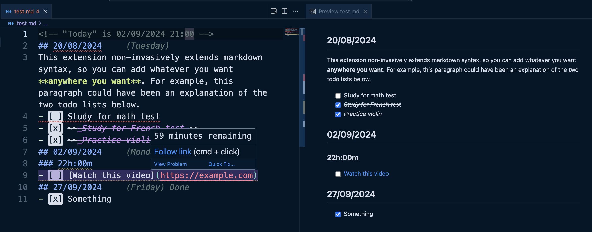

# Markdown-todo

This extension adds a simple **deadline** functionality to markdown lists. Simply add a date in the format dd/mm/yyyy before any markdown list to see the days remaining until that date (also warn when the deadline approaches). 

If the deadline is approaching, you get a squiggly line under the date. The remaining days are always appended to the end of the dates' line.

# **Adding a Deadline Section**

```md
<!-- "Today" is 23/07/2023 -->
22/07/2023
- [ ] Turn in math homework
- [ ] Learn German
27/07/2023
- [ ] Turn in English homework
- [ ] Learn French
```

Everything under a deadline is grouped as one. To begin a new deadline, simply add another date before the next list.

## Result:

 

# **Combining With Existing Markdown Syntaxes**

```md
<!-- "Today" is 23/07/2023 -->
## 23/07/2023
This extension non-invasively extends markdown syntax, so you can add whatever you want **anywhere you want**. For example, this paragraph could have been an explanation of the two todo lists below.
- [ ] Study for math test
- [x] ~~_Study for French test_~~
- [x] ~~_Practice violin_~~
## 25/07/2023
- [ ] [Watch this video](https://example.com)
```

## Result (left vscode, right rendered markdown)



The diagnostics was made to work in vscode. It just parses the markdown file and gives you diagnostics using vscode's LSP API. If you preview it (as seen on the right), you won't see all the deadline diagnostics and reports. But because the dates syntax are basically just markdown, if you render it you'll still see the dates, just not the reported diagnostics.

# **Ending a Section Early**

Due to the nature of the syntax, once you add a date, the parser will try to match any lists below it as a part of the deadline. Doesn't matter if it's already a new topic and you're writing about something else 300+ lines below the date.

To explicitly end a date section, you can add `<!-- end section -->` comment anywhere below the last list in the section to end it. 

```md
<!-- "Today" is 23/07/2023 -->
# **Math Stuff**
## 31/12/2023
- [x] Task1
- [x] Task2
## 01/07/2023
- [ ] Task3
<!-- end section -->
# English Stuff_ 
- [ ] Task1
- [ ] Task2
```

## Result


# Codeblocks

If you surround a date is found to be inside a codeblock, it is ignored.

\`\`\`
23/07/2023 <!-- Won't be parsed for diagnostics -->
- [ ] Task1
- [ ] Task2
\`\`\`